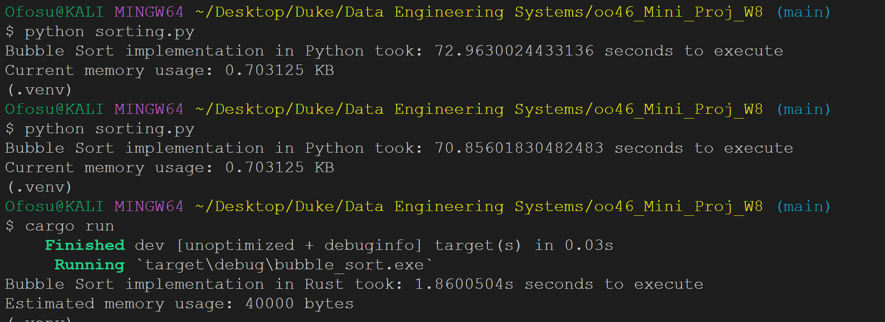

[][def]

# CLI Lab - Week 8 mini project

## Python vs Rust Speed Test
The purpose of this project is to assess the execution speed and resource usage of Python and Rust. The comparison involved implementing the Bubble Sort algorithm in both languages on an array of 10000 items. Each item is a random integer value ranging from 0 to 999. To maintain fairness in this comparison, both languages exclusively utilize standard libraries.
The results of these implementations are as follows:

# Quick Distinctions:
| Language | Execution Time    | Memory Usage |
|----------|-------------------|--------------|
| Python   | 70.85602 seconds  | 0.27734375 KB| 
| Rust     | 1.961307 seconds  | 40 KB        |

NB: The above table estimates the memory usage (specifically for the Rust implementation) based on the size of a single i32 element and the number of elements in the array. Please note that this is a rough estimate and doesn't provide detailed memory profiling. To get more accurate memory measurements, you may need to use external profiling tools and libraries specific to your platform.

## Analysis:
In the comparison of Python and Rust using the Bubble Sort algorithm, there are significant differences in execution time and memory usage. Rust outperforms Python in terms of both speed and memory efficiency.

### Execution Time:

Python: It took approximately 70.86 seconds to execute the Bubble Sort algorithm.
Rust: In contrast, Rust executed the same algorithm in just about 1.96 seconds. This is approximately 36 times faster than Python.

### Memory Usage:

Python: The memory usage during execution was minimal, at only 0.28 kilobytes (KB).
Rust: While Rust consumed more memory, approximately 40 KB, it remained efficient in comparison to Python.

These results highlight the advantages of Rust over Python in terms of performance and resource utilization. While Python is known for its simplicity and ease of use, Rust's emphasis on safety and efficiency is evident in this performance comparison. Depending on the specific requirements of a project, choosing Rust can lead to substantial gains in both execution speed and memory efficiency.

## Mini-project deliverables:

1. [Python - Bubble Sort](https://github.com/nogibjj/oo46_Mini_Proj_W8/blob/main/sorting.py) => Bubble Sort implemtation in Python.

2. [Rust - Bubble Sort](https://github.com/nogibjj/oo46_Mini_Proj_W8/blob/main/src/main.rs) => Bubble Sort implemtation in Rust.

### Application output:
Please note that the outcomes of the above implementations are influenced by specific hardware requirements and may vary on different systems.

[def]: https://github.com/nogibjj/oo46_Mini_Proj_W8/actions/workflows/cicd.yml
